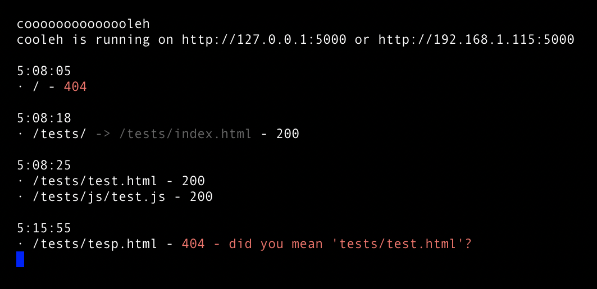

# cooleh

Ultra lightweight server written in go. Intended for quick testing of static sites and web experiments.

Created because `python -m http.server` is too hard to remember.

Features:
- clear logging in the terminal for each request, separated by session
- sends the correct content type headers for all files, including .wasm
- tells you your IP address within the local network
- catches typos and suggests corrections 

### Run

Download or build the binary and add it to your path.

In a directory with an HTML file, run:

    cooleh
    
### Build

To build the binary yourself and install:

    go install github.com/MattSimmons1/cooleh
